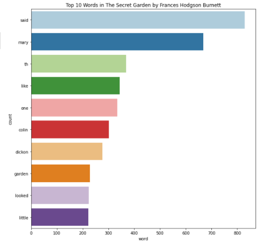

# big-data-project
This repository about process text data with Spark and Python.

### Text Data:
- Source:  https://www.gutenberg.org/ebooks/113
- Text data: https://www.gutenberg.org/files/113/113-0.txt  

### Tools & Languages:
 - Databricks community edition account
 - python
 - pyspark

### Processing text data:
 
1. Getting text data from url and storing in bigDataProject.txt
```
import urllib.request
urllib.request.urlretrieve("https://www.gutenberg.org/files/113/113-0.txt","/tmp/bigDataProject.txt")
```
2. Moving file to databricks file system and then convert data into RDD
```
dbutils.fs.mv("file:/tmp/bigDataProject.txt","dbfs:/data/bigDataProject.txt")
nodeRDD = sc.textFile("dbfs:/data/bigDataProject.txt")
```
3. Flatmap each line to words
``` 
wordsRDD = nodeRDD.flatMap(lambda line: line.lower().strip().split(" ") )
```
4. Removing non-letters using regular expression and map().
```
import re
no_regularRDD = wordsRDD.map(lambda word: re.sub('[^a-zA-Z]','',word))
```
5. Removing stop words in wordsRDD
```
from pyspark.ml.feature import StopWordsRemover
remove =StopWordsRemover()
stopWords = remove.getStopWords()
filteredRDD=no_regularRDD.filter(lambda word: word not in stopWords)
proper_wordsRDD = filteredRDD.filter(lambda x: x != "")
```
6. map() words to (word,1) intemediate key-value pairs
```
IKVPairsRDD = proper_wordsRDD.map(lambda word: (word,1))
```
7. reduceByKey() to get (word,count) results
```
wordCountRDD = IKVPairsRDD.reduceByKey(lambda acc,value: acc+value)
```
8. collect() action to get back to python
```
results = wordCountRDD.collect()
print(results)
```
9. Finding top 10 words
```
top_10_words = wordCountRDD.map(lambda x: (x[1], x[0])).sortByKey(False).take(10)
print(top_10_words)
```
10. Charting top 10 words
```
import numpy as np
import pandas as pd
import matplotlib.pyplot as plt
import seaborn as sns
from collections import Counter

# More about numpy from https://numpy.org/
# More about pandas from https://pandas.pydata.org/
# More about matplotlib from https://matplotlib.org/
# More about seaborn from https://seaborn.pydata.org/
# More about collections from https://docs.python.org/3/library/collections.html#collections.Counter

# prepare chart information
source = 'The Secret Garden by Frances Hodgson Burnett'
title = 'Top 10 Words in ' + source
xlabel = 'word'
ylabel = 'count'

# create Pandas dataframe from list of tuples
df = pd.DataFrame.from_records(top_10_words, columns =[xlabel, ylabel]) 
print(df)

# create plot (using matplotlib)
plt.figure(figsize=(15,15))
sns.barplot(xlabel, ylabel, data=df, palette="Paired").set_title(title)
```
### File: 
[big-data-project](./big-data-project.ipynb)

### Output:

### References:
- https://medium.com/@gulcanogundur/pyspark-word-count-b099106135a7


